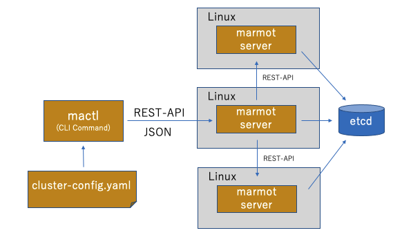

# 仮想サーバーの管理システム marmot 

検証、実験、そして学習のための、簡便で高速な仮想サーバーの実行環境であり、以下の特徴があります。

* 6コア程度の低スペックデスクトップPCなどにインストールして、仮想サーバーを複数起動できる
* 仮想サーバーの起動は、Dockerコンテナを起動するのと同じくらいの高速起動を実現
* YAMLファイルで仮想サーバーの構成を定義
* Ubuntu 20.04 以上で動作
* ゲストVMとして、Ubuntu 20.04, 22.04
* 複数のPCをクラスタ化して、プライベートなクラウド環境を構築
* Ansible playbookに適した仮想マシン


## アーキテクチャ
mactlコマンドに、仮想マシンのクラスタ構成 YAML を添えて実行することで、仮想マシンが起動します。クラスタは、1サーバーから、リソースのあるだけ起動できます。


複数のmarmotを導入したサーバーを並列化して、クラウドの様な環境を構築できます。




## セットアップ方法

CoreDNS,etcd,Open vSwitch,LVM,KVM などのインストールと設定の後、以下の要領で、起動することができます。インストールなどのドキュメントは順次拡充していきます。

### 事前準備

作成中


### marmotのインストール

```
TAG=v0.8.2
mkdir marmot
cd marmot
curl -OL https://github.com/takara9/marmot/releases/download/$TAG/marmot-$TAG.tgz
tar zvf marmot-$TAG.tgz
sudo ./install.sh
```


## 応用例

### Kubernetesクラスタの実行

作成中


### Cephストレージシステムの実行

作成中


### メトリックスとログ分析基盤

作成中


