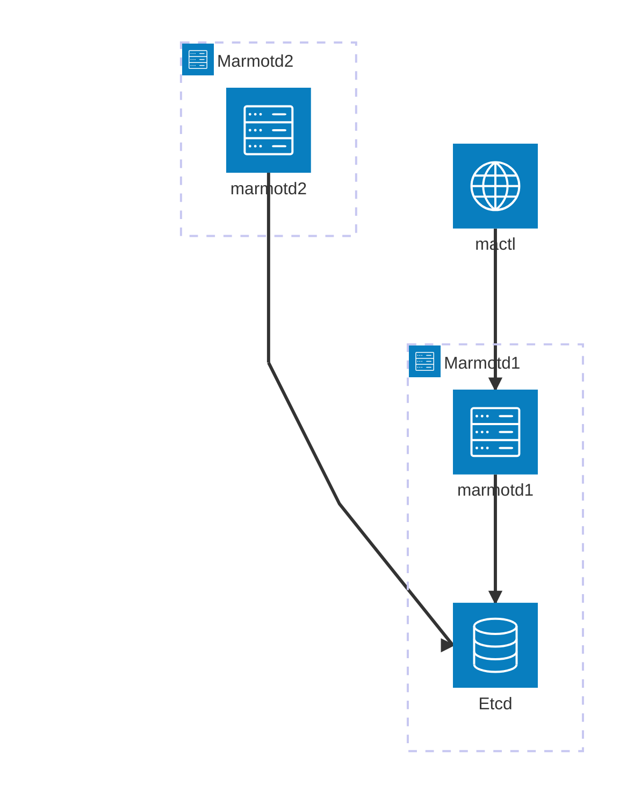

## marmotd のクラスタ化

### 目標
marmotd が稼働する仮想マシンのホストをクラスタ化して、仮想マシンを複数のホストに配置できるようにする。

### 実現手段
- marmotdが動作するサーバーを「仮想マシンホスト」と呼ぶ。
- etcdは、複数の「仮想マシンホスト」で共有して、オブジェクトのデータを共有する。
- etcdの可用性を向上させるには、etcdをクラスタ化して運用する。
- marmotdは、「仮想マシンホスト」で一つだけ動作する。
- marmotd は、自己ホスト名を取得して、自身のホスト名を認識する。設定ファイルではなく、OSからホスト名を取得する。
- 各種コントローラーは、自身のホストを認識して、自ホストに割り当てられた仮想マシンをデプロイする。
- ボリューム（BootとData）の「仮想マシンホスト」間での共有はスコープ外とする。（Ceph, iSCSIサーバーなどと連携できる段階になれば検討する。）

- etcdのオブジェクトには、「仮想マシンホスト」のホスト名を記録して、オブジェクトが動作する「仮想マシンホスト」が明らかになるようにする。
- クラスタを構成しない場合でも、「仮想マシンホスト」のホスト名を記録しておき、容易に「仮想マシンホスト」の増設に対応できるようにする。

- リーダーレスの構造にしたい。どの「仮想マシンホスト」にリクエストしても、同じ用に動作することを目指したい。（仮目標）
- ヘッドノードに仮想マシンをリクエストすると、スケジューラーがノードを選定して、etcdにオブジェクトを作成する。あとは、各仮想マシンホストのコントローラーが、自己のホストで仮想マシンをライフサイクルで管理する。
- /etc/marmotd.json を設定するのではなく、etcdを共有する他のホストを認識して、クラスタを構成する。そのために、marmotdは、自己ホストの情報を etcd に書き込み、更新する必要がある。

- 要求された仮想マシンを、仮想マシンホストに割り当てるため、スケジューラーを開発する。矛盾を起こさないために、スケジューラーが稼働するのは、全「仮想マシンホスト」の中で、１台だけにする。
- スケジューラーは、アクティブな「仮想マシンホスト」の中で、最もhostid が小さいノードが、スケジュールを担当する。
- スケジューラーは、各メンバーの「仮想マシンホスト」にスコアを計算して、負荷の少ない「仮想マシンホスト」のリストを作成して、スコアの良い順から割当を試みる。
 
- スコアの計算方法は、シンプルに稼働する仮想マシンの数とする。 CPU,メモリなどの空き容量, CPU使用率などもあるが、これらのパラメータは後日機能追加するとして、現時点ではもっとも単純な方法とする。
- marmotは、実CPUコア数、搭載メモリ量を、超えても良いという方針を取っているので、それに合致する形をとる。
- そのため、marmotdは、自己ホストコントローラーを作成して、仮想マシン数、使用メモリ量、CPU量などを収集して、etcdに記録する必要がある。次の機能追加のため、実現可能な構造を開発しておくこと。
- APIで、各ホストのリソース状況をリストして見れるようにしたい。

### 変更概要
- APIのオブジェクトに「仮想マシンホスト」の項目を追加設定
- 「仮想マシンホスト」のリースを管理するオブジェクトを実装
- dbパッケージに、「仮想マシンホスト」を、作成、更新、リスト、削除、キー取得などの関数を実装
- 自己ホストの状態を更新するコントローラーを実装
- スケジューラーの実装する

### 懸念事項

オブジェクトの重複を避ける機能が必要では？

最初は、etcdを共有する。そして、可用性を求められると、etcdは独立したetcdクラスタとして独立させ、可用性を高める。

初期構成図

ノード数が増えて、etcdに可用性が求められると、etcdをクラスタ化して、各marmotd からはetcdのクラスタをアクセスする。

