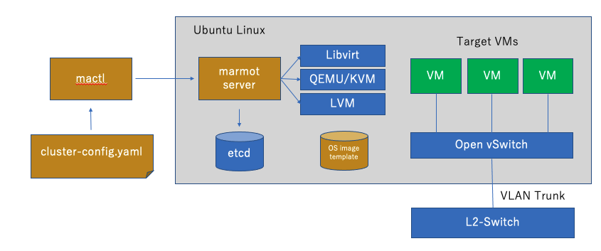
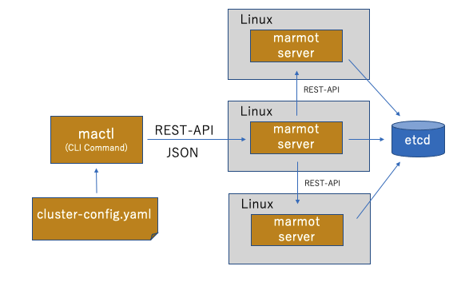

# マイクロ プライベート クラウド Marmot 

Marmotは、テスト、学習、実験用に設計された、高速で軽量な仮想サーバーオーケストレーションツールです。
YAMLで仮想サーバーのクラスタ構成を定義し、KVMやその他のLinuxネイティブテクノロジーを使用して数秒で起動できます。

## 特徴

- 高速起動（約30秒）の仮想サーバー
- YAMLベースの構成
- 複数マシンにわたるクラスタサポート
- CoreDNS、etcd、Open vSwitchなどとの統合
- Ubuntu 20.04/22.04のサポート
- Ansibleベースのセットアップ自動化
- OpenAPI v3 ベースのREST-APIで [MarmotサーバーをAPI](marmot-api-v1.html)操作


## インストール方法

CoreDNS,etcd,Open vSwitch,LVM,KVM などのインストールと設定の後、以下の要領で、起動することができます。インストールなどのドキュメントは順次拡充していきます。

データベースサーバーに、etcdを使用しています。
hvサーバー個別に、etcdをインストールするときは、以下の手順でインストールしてください。

```
sudo apt update && sudo apt install etcd
systemctl status etcd
```

- [ネットワークの設定方法](network-setup.md)
- [データベースの初期化方法](hv-admin/README.md)

marmotのインストール

```
TAG=v0.8.8
mkdir marmot
cd marmot
curl -OL https://github.com/takara9/marmot/releases/download/$TAG/marmot-$TAG.tgz
tar xzvf marmot-$TAG.tgz
sudo ./install.sh
```

## 使用例

構成ファイル　cluster-config.yaml を準備します。

```
domain: labo.local
os_variant:  ubuntu22.04
cluster_name: test
vm_spec:
  - name: "srv1"
    cpu: 1
    memory: 1024
    private_ip: "172.16.9.11"
    storage:
    - name: data
      size: 10
      vg:   vg2
    comment: "test node #1"
  - name: "srv2"
    cpu: 1
    memory: 1024
    private_ip: "172.16.9.12"
    storage:
    - name: data
      size: 10
      vg:   vg2
    comment: "test node #2"
```

構成ファイルが存在するディレクトリで、'mactl create'を実行することで、サーバーがデプロイされます。
起動まで、約30秒程度です。

```
ubuntu@hv0:~/marmot-apl$ mactl create
成功終了
ubuntu@hv0:~/marmot-apl$ mactl status
CLUSTER    VM-NAME          H-Visr STAT  VKEY                 VCPU  RAM    PubIP           PriIP           DATA STORAGE        
test       srv1             hv0    RUN   vm_srv1_0110         1     1024   172.16.9.11                     10  
test       srv2             hv0    RUN   vm_srv2_0111         1     1024   172.16.9.12                     10  
```

あとは、ログインして、追加の設定を実施できます。


```
ubuntu@hv0:~/marmot-apl$ ssh ubuntu@srv1.test.a.labo.local
Warning: Permanently added 'srv1.test.a.labo.local' (ED25519) to the list of known hosts.
Welcome to Ubuntu 22.04.1 LTS (GNU/Linux 5.15.0-86-generic x86_64)

 * Documentation:  https://help.ubuntu.com
 * Management:     https://landscape.canonical.com
 * Support:        https://ubuntu.com/advantage

```

起動したサーバーは、Ansibleを利用して、セットアップもできます。

```
ubuntu@hv0:~/marmot-apl$ ansible -i inventory all -m ping
srv1 | SUCCESS => {
    "ansible_facts": {
        "discovered_interpreter_python": "/usr/bin/python3"
    },
    "changed": false,
    "ping": "pong"
}
srv2 | SUCCESS => {
    "ansible_facts": {
        "discovered_interpreter_python": "/usr/bin/python3"
    },
    "changed": false,
    "ping": "pong"
}
```


## インストール方法

CoreDNS,etcd,Open vSwitch,LVM,KVM などのインストールと設定の後、以下の要領で、起動することができます。インストールなどのドキュメントは順次拡充していきます。

データベースサーバーに、etcdを使用しています。
hvサーバー個別に、etcdをインストールするときは、以下の手順でインストールしてください。

```
sudo apt update && sudo apt install etcd
systemctl status etcd
```

- [ネットワークの設定方法](network-setup.md)
- [データベースの初期化方法](hv-admin/README.md)


marmotのダウンロードとインストール

```
TAG=v0.8.2
mkdir marmot
cd marmot
curl -OL https://github.com/takara9/marmot/releases/download/$TAG/marmot-$TAG.tgz
tar xzvf marmot-$TAG.tgz
sudo ./install.sh
```

*応用例*

- [設定用Ansibles集](https://github.com/takara9/marmot-servers)
- [Kubernetesクラスタの実行](https://github.com/takara9/marmot-servers/tree/main/kubernetes)
- [Cephストレージシステムの実行](Https://Github.Com/Takara9/Marmot-servers/tree/main/ceph)
- [メトリックスとログ分析基盤](https://github.com/takara9/docker_and_k8s/tree/main/4-10_Observability)
- [GitHub Actionと連携したmarmot開発環境](https://github.com/takara9/marmot/docs/HOWTO-CI.md)


## アーキテクチャ
mactlコマンドに、仮想マシンのクラスタ構成 YAML を添えて実行することで、仮想マシンが起動します。クラスタは、1サーバーから、リソースのあるだけ起動できます。




複数のmarmotを導入したサーバーを並列化して、クラウドの様な環境を構築できます。




## ライセンス

このプロジェクトはMITライセンスの下で提供されています。詳細は[LICENSE](https://github.com/takara9/marmot?tab=MIT-1-ov-file)ファイルをご覧ください。

## 貢献

貢献を歓迎します！ガイドラインについては[CONTRIBUTING.md](https://github.com/takara9/marmot?tab=contributing-ov-file)をご覧ください。

## 連絡先

メンテナー: [takara9](https://github.com/takara9)
ご質問や議論については、[GitHub Discussions](https://github.com/takara9/marmot/discussions) をご利用ください。